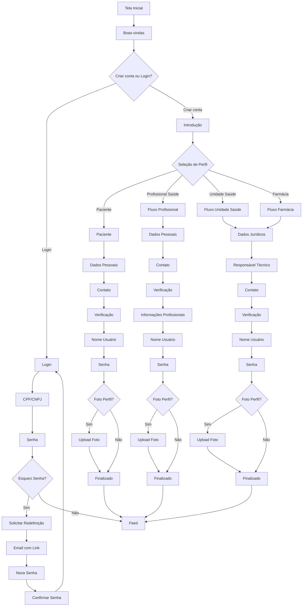

# Diagramas iSaúde

## Fluxo Geral de Cadastro



## Pacientes

```mermaid

---
config:
  layout: fixed
---
flowchart TD
    A["Feed Principal"] --> B["Post Individual"] & C["Perfil de Outro Usuário"] & D["Explorar"] & E["Sua Saúde"] & F["Conversas"] & G["Criar Publicação"] & E1["Meu Perfil"]
    B --> B1["Comentários"] & B2["Curtir Post"] & B3["Salvar Post"] & B4["Compartilhar"] & B5["Denunciar Post"]
    B1 --> B1a["Responder Comentário"]
    C --> C1["Publicações do Usuário"] & C2["Seguir/Deixar de Seguir"] & C3["Enviar Mensagem"] & C4["Agendar Consulta"]
    C4 --> C4a["Agendamentos"]
    D --> D1["Buscar Conteúdo"] & D2["Conteúdo Recomendado"]
    D1 --> D1a["Resultados de Busca"]
    G --> G1["Selecionar Tipo"]
    G1 --> G1a["Texto"] & G1b["Imagem"] & G1c["Vídeo"] & G1d["Pulse"]
    G1a --> G2["Compor Texto + Hashtags"]
    G1b --> G3["Selecionar Imagem"]
    G1c --> G4["Gravar/Selecionar Vídeo"]
    G1d --> G5["Gravar Vídeo Curto"]
    E --> E1 & E2["Meus Agendamentos"] & E3["Agendar Nova Consulta"] & E4["Prescrições e Atestados"] & E5["Histórico de Exames"] & E6["Prontuário"]
    E2 --> E2a["Detalhes do Agendamento"]
    E2a --> E2b["Cancelar Consulta"] & E2d["Reagendar"] & E2e["Juntar à Teleconsulta"]
    E2d --> E3
    E2e --> E2f["Sala de Espera Virtual"]
    E3 --> E3a["Buscar Profissional"]
    E3a --> E3b["Perfil Profissional"]
    E3b --> E3c["Selecionar Serviço"]
    E3c --> E3d["Escolher Data/Hora"]
    E3d --> E3e["Preencher Prontuário"]
    E3e --> E3f["Forma de Pagamento"]
    E3f --> E3g["Resumo da Compra"] & E3k["Ajuda com Pagamento"]
    E3g --> E3h["Confirmação"]
    E3h --> E3i["Adicionar à Agenda"]
    E3i --> E3j["Sincronizar Calendário"]
    E4 --> E4a["Visualizar Documento"]
    E4a --> E4b["Compartilhar Exame"] & E4c["Imprimir"]
    E5 --> E4a
    F --> F1["Lista"]
    F1 --> F1a["Nova Conversa"] & F2["Conversa"]
    F1a --> F1b["Selecionar Contato"]
    F2 --> F2a["Enviar Mensagem"]
    F2a --> F2b["Digitar Texto"] & F2c["Anexar Arquivo"]
    F2c --> F2d["Selecionar Tipo"]
    F2d --> F2e["Galeria"] & F2f["Câmera"] & F2g["Documentos"]
    F2g --> F2h["Prontuário iSaúde"] & F2i["Arquivo do Dispositivo"]
    F2i --> F2j["Visualizador de PDF"]
    E1 --> Z["Opções"] & Z1["Editar Perfil"]
    Z --> Z2["Informações Pessoais"] & Z3["Privacidade"] & Z4["Notificações"] & Z5["Acessibilidade"] & Z6["Central de Ajuda"] & Z7["Sair"]
    Z1 --> Z1a["Foto"] & Z1b["Nome"] & Z1c["Bio"]
    Z2 --> Z2a["CPF"] & Z2b["Email"] & Z2c["Telefone"]
    Z6 --> Z6a["FaQ"] & Z6b["Suporte"]
    D2 --> B
    C4a --> E3
````

## Profissionais

```mermaid

---
config:
  layout: dagre
---
flowchart TD
    A["Login"] --> B["Validação Documental"]
    B --> C["Área Profissional"]
    C --> D["Meu Perfil"] & E["Minha Agenda"] & F["Serviços"] & G["Atendimentos"] & H["Financeiro"] & I["Relatórios"] & J["Publicações"] & K["Conversas"] & L["Configurações"]
    D --> D1["Editar Perfil"] & D2["Visualizar Perfil Público"] & D3["Instituições Vinculadas"]
    D1 --> D1a["Alterar Foto"] & D1b["Alterar Bio"] & D1c["Áreas de Atuação"] & D1d["Especialidades"] & D1e["Formação"]
    D3 --> D3a["Buscar Instituição"]
    E --> E1["Visualizar Agenda"] & E2["Adicionar Evento"] & E3["Bloquear Horários"]
    E1 --> E1a["Visualização: Dia/Semana/Mês"]
    E2 --> E2a["Tipo: Consulta/Reunião/Folga"]
    E2a --> E2b["Definir Horário"]
    E3 --> E3a["Selecionar Período"]
    F --> F1["Meus Serviços"]
    F1 --> F1a["Adicionar Serviço"] & F1b["Editar Serviço"]
    F1a --> F1a1["Configurar Serviço"]
    G --> G1["Próximos Atendimentos"] & G2["Histórico de Atendimentos"]
    G1 --> G1a["Detalhes do Atendimento"]
    G1a --> G1a1["Prontuário do Paciente"] & G1a2["Iniciar Atendimento"]
    G1a1 --> G1a1a["Histórico Médico"] & G1a1b["Anotações Pré-Consulta"]
    G1a2 --> G1a2a["Sala de Atendimento"]
    G1a2a --> G1a2a3["Encerrar Atendimento"]
    G1a2a3 --> GA1["Emitir Documentos"]
    GA1 --> GA1a["Prescrição"] & GA1b["Atestado"] & GA1c["Solicitação de Exames"]
    GA1a --> GA1a1["Selecionar Medicamentos"]
    GA1a1 --> GA1a2["Adicionar Posologia"]
    GA1a2 --> GA1a3["Assinar Digitalmente"]
    GA1b --> GA1b1["Definir Período"]
    GA1b1 --> GA1b2["CID-10"]
    GA1b2 --> GA1b3["Assinar"]
    GA1c --> GA1c1["Selecionar Exames"]
    GA1c1 --> GA1c2["Adicionar Observações"]
    GA1c2 --> GA1c3["Assinar"]
    H --> H1["Extrato"]
    H1 --> H1a["Filtrar por Período"]
    H1a --> H1b["Detalhes de Transação"]
    I --> I1["Relatório de Atendimentos"] & I2["Desempenho"] & I3["Análise de Pacientes"]
    I1 --> I1a["Exportar PDF/CSV"]
    I2 --> I2a["Avaliações"] & I2c["Taxa de Ocupação"]
    I2a --> I2b["Responder Avaliação"]
    I2c --> I2d["Horários Ociosos"]
    I3 --> I3a["Fidelização"]
    J --> J1["Criar Publicação"] & J2["Engajamento"] & J3["Impulsionar Publicação"]
    J1 --> J1a["Tipo: Texto/Imagem/Vídeo/Pulse"]
    J1a --> J1b["Adicionar Conteúdo"]
    J1b --> J1c["Adicionar Hashtags"]
    J1c --> J1d["Publicar"]
    J2 --> J2a["Curtidas"] & J2c["Comentários"]
    J2a --> J2b["Ver Perfis"]
    J2c --> J2d["Responder"]
    J3 --> J3a["Selecionar Orçamento"]
    J3a --> J3b["Definir Público-Alvo"]
    J3b --> J3c["Confirmar"]
    K --> K1["Conversas"]
    K1 --> K1a["Nova Mensagem"] & K2["Conversa Existente"]
    K1a --> K1b["Selecionar Contato"]
    K1b --> K1c["Enviar Mensagem"]
    K2 --> K2a["Histórico de Mensagens"] & K2e["Iniciar Videochamada"]
    K2a --> K2b["Enviar Nova Mensagem"]
    K2b --> K2c["Anexar Documento"]
    K2c --> K2d["Selecionar do Prontuário"]
    K2e --> K2f["Sala de Atendimento"]
    L --> L1["Informações Profissionais"] & L2["Preferências de Agenda"] & L4["Privacidade"] & L5["Notificações"] & L6["Acessibilidade"] & L7["Central de Ajuda"] & L8["Sair"]
    L1 --> L1a["Atualizar Registro"]
    L1a --> L1b["Documentos Comprobatórios"]
    L2 --> L2a["Horário Comercial"]
    L2a --> L2b["Bloqueios Recorrentes"]
    L7 --> L7a["FAQ"]
    L7a --> L7b["Suporte Técnico"]
    L7b --> L7c["Chat de Suporte"]
```


## Unidades de Saúde
```mermaid
---
flowchart TD
    %% FLUXO DE CADASTRO
    subgraph Cadastro
        A[Tela Inicial] --> B[Boas-Vindas]
        B --> C[Criar Conta]
        C --> D[Introdução: Vantagens]
        D --> E[Continuar como Unidade de Saúde]
        
        E --> F1["Step 1: CNPJ, Razão Social, Nome Fantasia, Tipo de Unidade, Termos"]
        F1 --> F2["Step 2: Responsável Técnico (CPF, Registro Profissional, Telefone)"]
        F2 --> F3["Step 3: Endereço (CEP, Número, Complemento, Estado, Cidade)"]
        F3 --> F4["Step 4: Contato (E-mail Institucional, Telefone) + Verificação"]
        F4 --> F5["Step 5: Escolher Nome de Usuário"]
        F5 --> F6["Step 6: Criar Senha"]
        F6 --> F7[Foto de Perfil Opcional]
        F7 --> G[Finalizar Cadastro]
    end

    %% PRIMEIRO ACESSO E VALIDAÇÃO
    G --> H[Validação de Documentos]
    subgraph Validacao
        H --> H1[Upload: Documento Oficial, Carteira Profissional, Selfie]
        H1 --> H2[Validação em Segundo Plano]
        H2 --> I[Menu Principal]
    end

    %% MENU PRINCIPAL
    subgraph Menu
        I --> J[Início / Feed]
        I --> K[Explorar]
        I --> L[Área Profissional]
        I --> M[Conversas]
    end

    %% ÁREA PROFISSIONAL - CONFIGURAÇÃO INICIAL
    subgraph Configuracao_Inicial
        L --> N{Primeiro Acesso?}
        N -->|Sim| O["Adicionar Informações: Horário de Funcionamento, Endereço, Serviços, Chave PIX"]
        O --> P[Área Profissional Liberada]
        N -->|Não| P
    end

    %% ÁREA PROFISSIONAL - GERENCIAMENTO
    subgraph Gerenciamento
        P --> Q[Horário de Atendimento]
        P --> R[Serviços]
        P --> S[Histórico de Atendimentos]
        P --> T[Endereços]
        P --> U[Financeiro]
        P --> V[Relatórios]
        P --> W[Avaliações]
        P --> X[Agenda de Atendimentos]
        P --> Y[Minha Equipe]
        P --> Z[Painel de Recursos]
    end

    %% SUBFLUXOS DETALHADOS
    %% Serviços
    R --> R1[Novo Exame]
    R1 --> R11["Definir: Exames, Valor, Dias de Atendimento"]
    R --> R2[Novo Atendimento]
    R2 --> R21["Definir: Título, Descrição, Duração, Modalidade, Retorno, Valor"]

    %% Minha Equipe
    Y --> Y1[Vincular Profissional]
    Y1 --> Y11[Buscar por CPF/Registro]
    Y11 --> Y12[Validar Documentos]
    Y12 --> Y13[Confirmar Vinculação]

    %% Agenda
    X --> X1[Visualizar Agendamentos]
    X1 --> X11[Detalhes do Agendamento]
    X11 --> X12[Disponibilizar Prescrições/Exames]
    X11 --> X13[Gerenciar Pós-Atendimento]
```
